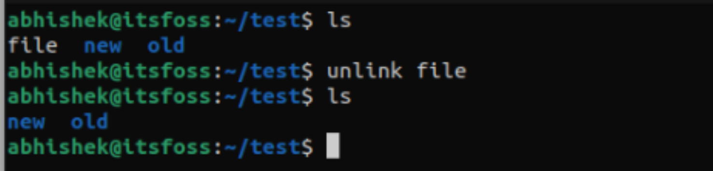
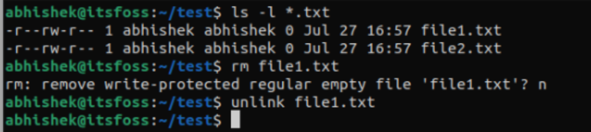

# **10 使用 unlink 删除文件吗**

在 Linux 中删除文件，我们通常使用 rm 命令。除此以外，还有另外一个命令，可以用于删除文件和链接，这就是 unlink 命令。

**虽然它听起来像是只能删除 Linux 系统中的链接，但实际上，也可以删除文件。**

Linux 系统中删除文件的过程是非常迅速的，只是一瞬间。

当你删除文件时，Linux 内核发现它对应于索引节点**编号 X**，**系统会将其从目录列表中删除文件条目，并将索引节点 X 的链接计数减少1**，

**这时候，索引节点 X 的链接计数为0，内核会认为没有人链接到此索引节点，所以就可以安全的删除索引节点，并删除与其关联的数据块。**

现在我们来看一下如何使用 unlink 命令。

### **unlink 命令**

如前文所述，unlink 命令用于删除文件和链接，其中链接包括软链接和硬链接。它是最简单的命令之一，除了 `--help` 以及 `--version` 以外，没有任何其他选项。

使用 unlink 删除文件，可以这样：

```
unlink filename
```

**删除链接，可以这样使用：**

```
unlink link_name
```

删除成功后，不会有任何输出：



这就是 unlink 命令的功能，除此以外不做任何其他事情。

### **unlink 不能同时删除多个文件和链接**

**`<mark>`rm 命令可以一次删除多个文件。但是 unlink 却不能，它一次只能删除一个文件或者链接，而且，也不能使用全局模式**（`Globbing patterns`）。

```
$ unlink *.txt

unlink: extra operand ‘file2.txt’
Try 'unlink --help' for more information.
```

**同时删除多个链接也会如此。**

### **使用 unlink 不能删除目录**

GNU 实现下的 unlink 命令是无法删除目录的，如果给定的文件名称是一个目录，就会报错：

```
$ unlink new_dir
unlink: cannot unlink 'new_dir': Is a directory
```

### **rm 和 unlink 的区别**

**unlink 命令使用 unlink 系统命令，而 rm 命令使用 unlinkat 系统调用，两个系统调用几乎相同**。但是这两个命令之间还是有一些明显的差异。

如前文所述，

* **unlink 命令在同一时间只能删除一个文件或链接，而 rm 命令可以删除多个**；
* **unlink 命令不能删除目录，而 rm 命令能删除目录**。

rm 命令在执行的时候，首先会安全检查，如果你没有文件的写权限，那么系统会要求你给出写权限（sudo或者切换至管理员用户），或者使用强制删除选项 `-f`；

**而 unlink 则不会进行安全检查，直接删除文件**。



另外，与 rm 不同，unlink 没有其他选项。

在某些情况下，相比于 rm，你可能更喜欢使用 unlink。比如你希望强制删除一个文件，而不考虑安全或者权限问题；或者如果删除失败（比如文件不存在）的话你希望能看到报错信息，这种情况下就可以使用 unlink。

因为使用 `rm -f ` 强制删除文件，如果文件不存在的话，不会显示任何错误信息。
