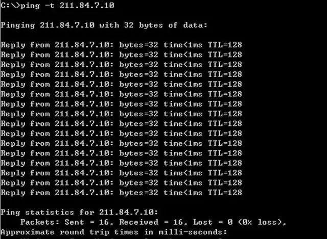

# **ping 命令详细使用**

## **一、ping 基本使用详解**

* 1、用来检测网络的连通情况和分析网络速度
* 2、根据域名得到服务器 IP
* 3、根据 ping 返回的 TTL 值来判断对方所使用的操作系统及数据包经过路由器数量。


我们通常会用它来直接 ping ip 地址，来测试网络的连通情况。

```
$ ping 115.61.50.31
PING 115.61.50.31 (115.61.50.31): 56 data bytes
64 bytes from 115.61.50.31: icmp_seq=0 ttl=54 time=33.630 ms
64 bytes from 115.61.50.31: icmp_seq=1 ttl=54 time=33.784 ms
64 bytes from 115.61.50.31: icmp_seq=2 ttl=54 time=34.899 ms
64 bytes from 115.61.50.31: icmp_seq=3 ttl=54 time=33.411 ms
^C
--- 115.61.50.31 ping statistics ---
4 packets transmitted, 4 packets received, 0.0% packet loss
round-trip min/avg/max/stddev = 33.411/33.931/34.899/0.574 ms
```

类如这种，直接 ping ip 地址或网关，ping 通会显示出以上数据，有朋友可能会问，bytes=64；time<1ms；TTL=33 这些是什么意思。

* bytes 值：数据包大小，也就是字节。
* time 值：响应时间，这个时间越小，说明你连接这个地址速度越快。

TTL 值：Time To Live, 表示 DNS 记录在 DNS 服务器上存在的时间，它是 IP 协议包的一个值，告诉路由器该数据包何时需要被丢弃。可以通过 Ping 返回的 TTL 值大小，粗略地判断目标系统类型是 Windows 系列还是 UNIX/Linux 系列。

默认情况下，Linux 系统的 TTL 值为 64 或 255，WindowsNT/2000/XP 系统的 TTL 值为 128，Windows98 系统的 TTL 值为 32，UNIX 主机的 TTL 值为 255。

因此一般 TTL 值：

* 100~130ms 之间，Windows 系统 ；
* 240~255ms 之间，UNIX/Linux 系统。

当然，我们今天主要了解并不是这些，而是 ping 的其它参考。

ping 命令除了直接 ping 网络的 ip 地址，验证网络畅通和速度之外，它还有这些用法。

```
 ping -a
usage: ping [-AaDdfnoQqRrv] [-c count] [-G sweepmaxsize]
            [-g sweepminsize] [-h sweepincrsize] [-i wait]
            [-l preload] [-M mask | time] [-m ttl] [-p pattern]
            [-S src_addr] [-s packetsize] [-t timeout][-W waittime]
            [-z tos] host
       ping [-AaDdfLnoQqRrv] [-c count] [-I iface] [-i wait]
            [-l preload] [-M mask | time] [-m ttl] [-p pattern] [-S src_addr]
            [-s packetsize] [-T ttl] [-t timeout] [-W waittime]
            [-z tos] mcast-group
Apple specific options (to be specified before mcast-group or host like all options)
            -b boundif           # bind the socket to the interface
            -k traffic_class     # set traffic class socket option
            -K net_service_type  # set traffic class socket options
            --apple-connect       # call connect(2) in the socket
            --apple-time          # display current time
```

### **二、ping -t 的使用**

不间断地 Ping 指定计算机，直到管理员中断。



### **三、ping -a 的使用**

`ping-a ` 解析计算机名与 NetBios 名。就是可以通过 ping 它的 ip 地址，可以解析出主机名。