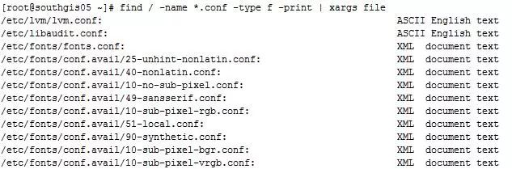
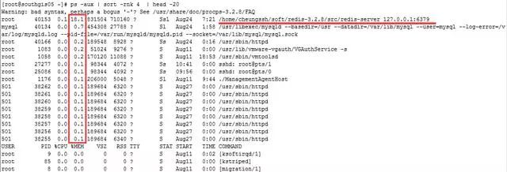
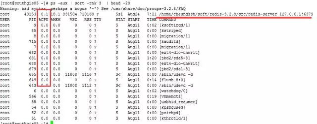
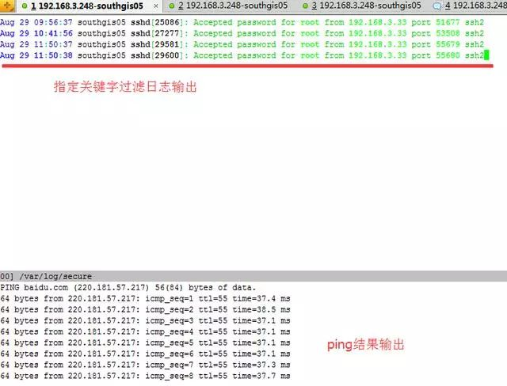
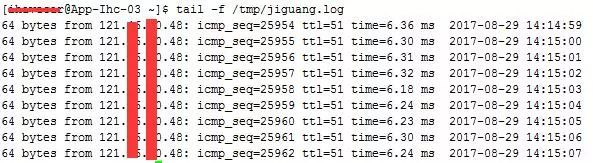
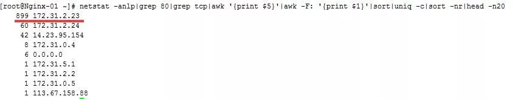

# Linux 实用运维命令 - Update

### 1、实用的 xargs 命令

比如说我们想找出某个路径下以 `.conf `结尾的文件，并将这些文件进行分类，那么普通的做法就是先将以 `.conf `结尾的文件先找出来，然后输出到一个文件中，接着cat这个文件，并使用file文件分类命令去对输出的文件进行分类。

这个普通的方法还的确是略显麻烦，那么这个时候xargs命令就派上用场了。

例1：找出 / 目录下以.conf 结尾的文件，并进行文件分类

```
# find / -name *.conf -type f -print | xargs file
```

输出结果如下所示：



### 2、命令或脚本后台运行

比如说我们想把数据库的导出操作后台运行，并且将命令的操作输出记录到文件，那么我们可以这么做：

```
nohup mysqldump -uroot -pxxxxx --all-databases > ./alldatabases.sql &（xxxxx是密码）
```

当然如果你不想密码明文，你还可以这么做：

```
nohup mysqldump -uroot -p --all-databases > ./alldatabases.sql  （后面不加&符号）
```

执行了上述命令后，会提示叫你输入密码，输入密码后，该命令还在前台运行，但是我们的目的是后天运行该命令，这个时候你可以按下Ctrl+Z，然后在输入bg就可以达到第一个命令的效果，让该命令后台运行，同时也可以让密码隐蔽输入。

命令后台执行的结果会在命令执行的当前目录下留下一个 nohup.out 文件，查看这个文件就知道命令有没有执行报错等信息。

### 3、找出当前系统内存使用量较高的进程


命令：# `ps -aux | sort -rnk 4  | head -20`




输出的第4列就是内存的耗用百分比。最后一列就是相对应的进程。

### 4、找出当前系统CPU使用量较高的进程

在很多运维的时候，我们发现CPU耗用较为严重，那么怎么样才能找出CPU消耗的进程排序呢？

命令：# `ps -aux | sort -rnk 3  | head -20`




### 5、同时查看多个日志或数据文件

在日常工作中，我们查看日志文件的方式可能是使用tail命令在一个个的终端查看日志文件，一个终端就看一个日志文件。

包括我在内也是，但是有时候也会觉得这种方式略显麻烦，其实有个工具叫做 multitail 可以在同一个终端同时查看多个日志文件。

首先安装 multitail：


```
# wget ftp://ftp.is.co.za/mirror/ftp.rpmforge.net/redhat/el6/en/x86_64/dag/RPMS/multitail-5.2.9-1.el6.rf.x86_64.rpm
# yum -y localinstall multitail-5.2.9-1.el6.rf.x86_64.rpm
```


multitail 工具支持文本的高亮显示，内容过滤以及更多你可能需要的功能。

如下就来一个有用的例子：

此时我们既想查看secure的日志指定过滤关键字输出，又想查看实时的网络ping情况：

命令如下：

```
# multitail -e "Accepted" /var/log/secure  -l "ping baidu.com"
```




### 6、持续 ping 并将结果记录到日志

```
ping api.jpush.cn  | awk '{ print $0"\t" strftime("%Y-%m-%d %H:%M:%S",systime()) } ' >> /tmp/ping.log &`
```

输出的结果会记录到`/tmp/ping.log` 中，每秒钟新增一条ping记录，如下：



### 查看tcp连接状态

指定查看80端口的tcp连接状态，有利于分析连接是否释放，或者攻击时进行状态分析。

命令：`# netstat -nat |awk '{print $6}'|sort|uniq -c|sort -rn`

### 8、查找80端口请求数最高的前20个IP

有时候业务的请求量突然上去了，那么这个时候我们可以查看下请求来源IP情况，如果是集中在少数IP上的，那么可能是存在攻击行为，我们使用防火墙就可以进行封禁。命令如下：

```
# netstat -anlp|grep 80|grep tcp|awk '{print $5}'|awk -F: '{print $1}'|sort|uniq -c|sort -nr|head -n20`
```



### 9、ssh实现端口转发

可能很多的朋友都听说过ssh是linux下的远程登录安全协议，就是通俗的远程登录管理服务器。但是应该很少朋友会听说过ssh还可以做端口转发。

其实ssh用来做端口转发的功能还是很强大的，下面就来做示范。

> 实例背景：我们公司是有堡垒机的，任何操作均需要在堡垒机上进行，有写开发人员需要访问ELasticSearch的head面板查看集群状态，但是我们并不想将ElasticSearch的9200端口映射出去，依然想通过堡垒机进行访问。
> 
> 
> 所以才会将通往堡垒机（192.168.1.15）的请求转发到服务器ElasticSearch（192.168.1.19）的9200上。

例子：

将发往本机（192.168.1.15）的9200端口访问转发到192.168.1.19的9200端口

```
ssh -p 22 -C -f -N -g -L 9200:192.168.1.19:9200 ihavecar@192.168.1.19`
```

记住：前提是先进行秘钥传输。

命令执行完后，访问192.168.1.15:9200端口则真实是访问192.168.1.19:9200端口。


