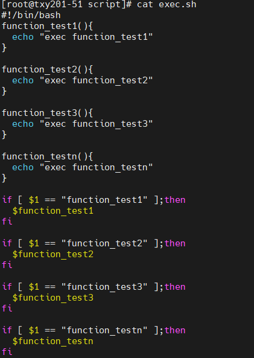
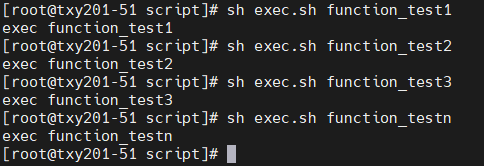
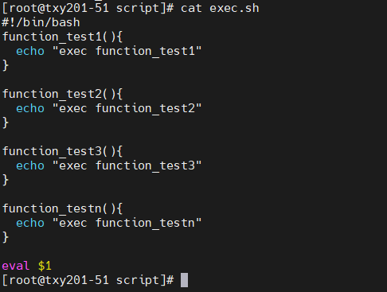
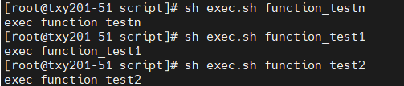
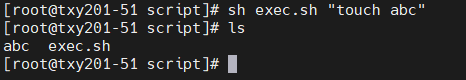
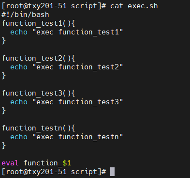
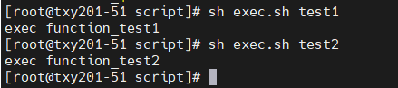
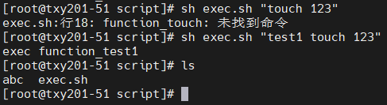

# Bash脚本多函数使用eval提高脚本编写效率！

执行如下：

这样在函数多的情况下需要写很多判断，效率低下。

我们可以使用`eval`命令来进行执行，如：

执行效果与上面一致：

但是这样会带来一个安全的问题，如果用户输入的是一条命令的话...

我想到了一个最简单的方法，那就是加个自定前缀，比如我每个方法都加上了

`function_`字段，在执行的时候直接输入`function_`后面一串字符即可（但是这个要和别人协商好，写好readme）。

修改后执行效果如下：

输入其它如命令等参数：

