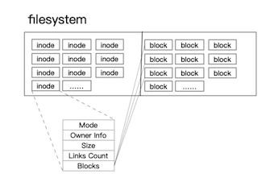
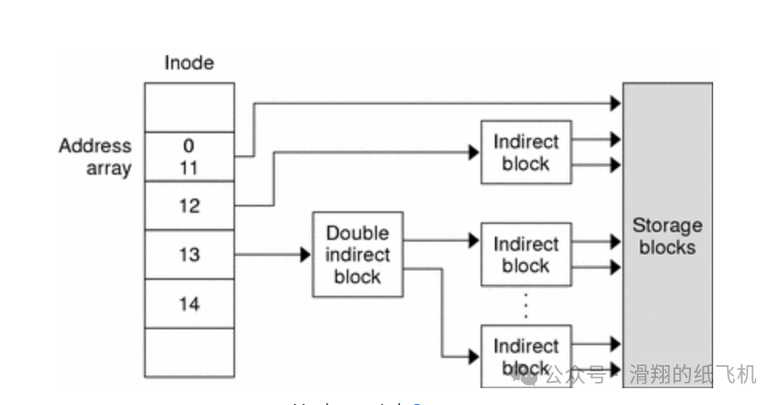

# Linux inode 介绍与清理

## 1 什么是 inode？

inode 是一种文件数据结构，用于存储除文件名和数据之外的任何 Linux 文件的信息。

 

示例：stat 查看 inode：

```
root@dev:~# stat domain.txt
--------------------------------------------------------------------------------------
  File: domain.txt
  Size: 30          Blocks: 8          IO Block: 4096   regular file
Device: fc01h/64513d    Inode: 6362        Links: 1
Access: (0644/-rw-r--r--)  Uid: (    0/    root)   Gid: (    0/    root)
Access: 2024-01-05 01:21:46.196735160 +0800
Modify: 2023-12-29 00:11:28.349067755 +0800
Change: 2023-12-29 00:11:28.349067755 +0800
 Birth: -
```


## 2. inode 是用来做什么的？

Linux 中，数据以固定大小的块形式存储在磁盘上。**如果你保存的文件超过了一个标准块的大小，系统就会查找下一个可用区段来存储文件的其余部分**。久而久之，就会变得非常混乱，**这时候就需要 inode 了**。


inode 虽然不包含文件的任何实际数据，**但却存储着文件的元数据，包括可以找到文件数据的所有存储块**。

**<mark>inode 中包含的信息：</mark>**

* 文件大小；
* 存储文件的设备；
* 与文件相关的用户和组 ID；
* 访问文件所需的权限；
* 创建、读取和写入时间戳；
* 数据位置（但不包括文件路径）；

**inode 与文件名无关，这意味着可以复制一个文件，重新命名后，它仍然指向与原始文件相同的 inode**。

## 3. inode 是如何工作的？

创建新文件时，会分配一个 inode 编号和一个文件名，**inode 编号是文件系统中唯一的编号，文件名和 inode 编号都作为条目存储在目录中**。 

**<mark>当运行 ls 命令，如 "ls -li /"时，文件名和 inode 编号是存储在 / 目录中的内容</mark>**。

其余的用户、组、文件权限、大小等信息是使用 inode 编号从 inode 表中获取的。

**<mark>在 Linux 中使用 df 命令可以列出每个文件系统的 inode 信息：`df -hi`</mark>**。

## 4.inode & 软/硬 链接

Linux 中创建符号链接时，inode 会发生什么变化？

示例目录：创建软连接命令 **`ln -s ../file1 slink`**

```
root@dev:~/linux/inode# tree
--------------------------------------------------------------------------------------
.
├── dir
│   └── slink -> ../file1
└── file1
```

递归列出并显示 inode 信息：

```
root@dev:~/linux/inode# ls -liR
--------------------------------------------------------------------------------------
.:
total 4
161992 drwxr-xr-x 2 root root 4096 Feb  1 00:08 dir
  6108 -rw-r--r-- 1 root root    0 Feb  1 00:04 file1

./dir:
total 0
6247 lrwxrwxrwx 1 root root 8 Feb  1 00:08 slink -> ../file1
```

可以看到，dir 和 file1 的 inode 编号不同，软链接也一样。**创建软链接时，会创建一个新文件，在元数据中，它指向目标文件，每创建一个软链接，就使用一个 inode**。

接下来，看下硬链接。

<mark>使用 ln 命令在 dir1 中创建硬链接：**`ln ../file1 hlink1`**</mark>


显示 inode：

```
root@dev:~/linux/inode# ls -liR
--------------------------------------------------------------------------------------
.:
total 4
161992 drwxr-xr-x 2 root root 4096 Feb  1 00:14 dir
  6108 -rw-r--r-- 2 root root    0 Feb  1 00:04 file1

./dir:
total 0
6108 -rw-r--r-- 2 root root 0 Feb  1 00:04 hlink
6247 lrwxrwxrwx 1 root root 8 Feb  1 00:08 slink -> ../file1
```

**可以看到，"file1″ 和 "hlink"的 inode 编号相同**。之所以相同是因为：硬链接不会创建新文件，它只是为相同的数据提供了一个新名称。

inode 工作方式决定了无法在不同文件系统之间创建硬链接。如果允许这样做，就有可能出现节点编号冲突的情况。而软链接则可以在不同文件系统之间创建。

**由于硬链接的 inode 号与原始文件的 inode 号相同，因此可以删除原始文件，但数据仍可通过硬链接使用（如上示例，删除原始文件 file1 情况下，hlink 依旧可以访问）**。

在这种情况下，**你所做的就是删除指向该 inode 编号的其中一个名称。链接到该 inode 编号的数据仍可使用，直到与之相关的所有名称都被删除**。

**inode 也是 Linux 系统无需重启即可更新的一个重要原因**。

这是因为一个进程可以使用一个库文件，而另一个进程可以用新版本替换该文件。因此，要为新文件创建一个新的 inode。已经运行的进程将继续使用旧文件，而对它的每次新调用都将使用新版本。

## 5. 元数据超过 inode 大小

与固定大小的数据块一样，inode 也是统一的。**你有可能拥有一个超过你的 inode 大小的文件**。

**在这种情况下，你的原始 inode 必须指向另一个 inode，才能完全包含文件的元数据，这就是所谓的间接指针**。

 

此外，磁盘上的 inode 数量是静态的。

这意味着，如果你有足够多的文件，你可能会在磁盘空间用完之前用完 inode。如果你的 inode 用完了，即使给定分区上还有剩余空间，也无法创建新文件。

## 6. Linux 常用 inode 相关命令

###  6.1 显示文件系统 inode 信息

使用 df -i 命令查看有关 inode 使用情况，包括存储 inode 的文件系统、总 inode 数量、使用中的数量（数量和百分比）以及剩余数量

```
root@dev:~# df -i
--------------------------------------------------------------------------------------
Filesystem       Inodes   IUsed    IFree IUse% Mounted on
udev            2043274     438  2042836    1% /dev
tmpfs           2047671    1008  2046663    1% /run
/dev/vda1      12902400 1437018 11465382   12% /
tmpfs           2047671       1  2047670    1% /dev/shm
tmpfs           2047671       3  2047668    1% /run/lock
tmpfs           2047671      18  2047653    1% /sys/fs/cgroup
/dev/loop0          815     815        0  100% /snap/lxd/24061
/dev/loop1        12041   12041        0  100% /snap/core20/2105
/dev/loop3          658     658        0  100% /snap/snapd/20671
/dev/loop2          658     658        0  100% /snap/snapd/20290
/dev/loop4        11991   11991        0  100% /snap/core20/2015
/dev/vda15            0       0        0     - /boot/efi
```

或者：**`root@dev:~# df -i /dev/vda1`**

### 6.2 显示指定文件 inode 信息 stat

通过 stat 命令显示指定文件或目录的 inode 信息：

```
root@dev:~# stat domain.txt
--------------------------------------------------------------------------------------
  File: domain.txt
  Size: 30          Blocks: 8          IO Block: 4096   regular file
Device: fc01h/64513d    Inode: 6362        Links: 1
Access: (0644/-rw-r--r--)  Uid: (    0/    root)   Gid: (    0/    root)
Access: 2024-01-05 01:21:46.196735160 +0800
Modify: 2023-12-29 00:11:28.349067755 +0800
Change: 2023-12-29 00:11:28.349067755 +0800
 Birth: -
```

* Size：文件的字节数
* type：文件类型，普通文件，目录，管道等等
* Inode：inode number
* Links：链接数，链接到该 inode 的硬链接数
* Access：读、写、执行权限
* Uid：文件所有者 User ID
* Gid：所有者组 Group ID
* Access：时间戳，最近一次访问的时间
* Modify：时间戳，最近一次修改文件内容的时间
* Change：时间戳，最近一次更改文件的时间（如执行 chmod、chown 等命令）

只列出文件 inode number:

```
root@dev:~# stat --format=%i domain.txt
--------------------------------------------------------------------------------------
6362
```

### 6.3 显示文件 inode number

ls 命令用于列出目录的内容，配合 -i 参数可用于显示每个文件的 inode number：

```
root@dev:~# ls -i
--------------------------------------------------------------------------------------
   2710 README.md     
```

使用 -i num 查找与特定 inode 相关的文件

```

root@dev:~/linux/test# find ./ -inum 2547
--------------------------------------------------------------------------------------
./test.txt
```

### 6.4 查看每个inode节点的大小

```
root@dev:~/linux/test# dumpe2fs -h /dev/vda1 | grep -i "inode size"
--------------------------------------------------------------------------------------
dumpe2fs 1.45.5 (07-Jan-2020)
Inode size:           256
```

## 7 如何释放Linux inode？

### 7.1. 为什么要限制 inode？

每个 inode 包含文件的关键信息，如文件大小、访问权限以及所存储磁盘块的位置等。这些数据是系统使用文件的必要条件。在 ext（ext、ext2、ext3、ext4）文件系统中，inode 保存在一个固定大小的表中。该表的大小在创建分区时就已决定，以后无法更改。

其他文件系统（例如 macOS 上使用的 APFS）不使用固定大小的表，而是使用 B-trees 等其他数据结构。因此，inode 数量要灵活得多。

### 7.2 设置 inode 限制

**inode 限制是在创建分区时设置的**。

默认系统提供合理的配置参数，通常不需要担心这个问题。不过，如果我们知道系统将存储大量的小文件，我们可以覆盖这些默认值，设置合理的 inode 数量。

例如，预计系统中的文件平均大小只有 1 kB。可以创建一个 ext4 分区，每 1000 字节为一个 inode：

```
$ sudo mkfs.ext4 -i 1000 /dev/sdev
```

或者，也可以选择其他文件系统，比如 Btrfs，它就不会有限制 inode 的问题。


### 7.3 检查并释放 inode

可以使用 df 命令检查可用的 inode：

```
root@dev:~/linux/dir1# df -i
------------------------------------------------------------------------------------
Filesystem       Inodes   IUsed    IFree IUse% Mounted on
udev            2043274     438  2042836    1% /dev
tmpfs           2047671    1008  2046663    1% /run
/dev/vda1      12902400 1437038 11465362   12% /
tmpfs           2047671       1  2047670    1% /dev/shm
```

**<mark>"IUsed" 列显示已使用的 inode 数量，"IFree" 列显示空闲 inode 数量，"IUse%" 列显示已使用 inode 的百分比</mark>**。


除了删除我们不需要的文件外，目前没有其他办法释放 inode。问题是，我们有时可能不知道该去哪里找耗尽 inode 限制的文件。

解决这个问题的方法是根据目录中文件的数量进行排序。通过这种方法，可以快速定位找到有问题的目录。

如，列出所有文件：

```
sudo find . -xdev -type f | cut -d "/" -f 2 | sort | uniq -c | sort -n
...
1585 Documents
6979 Downloads
7168 Pictures
113659 .nvm
669666 Library
980996 Projects
```

可以看到，**"Projects" 目录中存储的文件数量最多**。此时，可以通过判断文件重要性采取一些措施，如：删除文件或将该目录移动到其他空闲 inode 的存储驱动器。

**常用清理命令：**

(1)、查看并删除临时文件：

示例命令：

```
ls -lt /tmp | wc -l
find /tmp -type f -exec rm {} \;
```

(2)、**删除0字节的文件，这些文件也会占用inode**：

示例命令：

```
find /home -type f -size 0 -exec rm {} \;
```

(3)、或者将目录文档归档，然后删除文件：

示例命令：

```
tar czvf /linux/backup.tar.gz /home/test
rm /home/test
```

