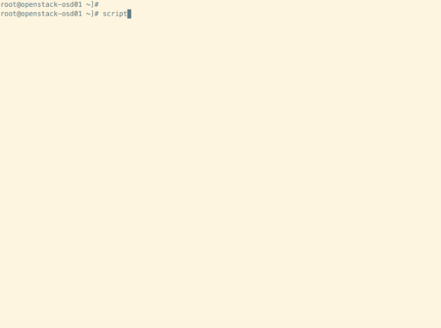
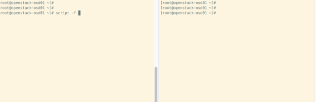
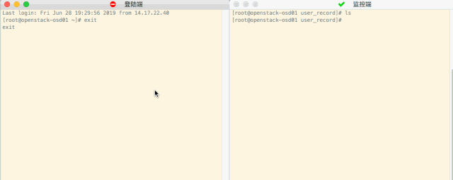

# **Linux script 录播**

## **录播屏幕操作**

**录制**

```
script -t 2>time.file -a scriptfile
```

执行完这个命令，接下来的任何操作都会被记录。
其中的`time.file`是时序记录文件，记录了几秒执行的命令；

`scriptfile`是命令执行记录文件，记录下执行是哪些命令，这两个文件名称都可以自定义。

**加上`-q,` `--quiet` 参数可以使script命令以静默模式运行**，不显示script启动和exit的命令，用户可以完全察觉不到在录屏。

```
script -q -t 2>time.file -a scriptfile
```

要停下来，只用按下按下组合键 Ctrl+D 结束录制，执行exit命令也行。

```
$ exit
```

**有录制就有播放，就像录视频一样，执行下面这个命令即可，时序文件在前，命令文件在后**

```
scriptreplay time.file scriptfile
```

**添加这个参数`-d`, `–divisor number `可以调整播放速度的倍数（可以是小数：放慢**）。

`scriptfile` 文件记录了我每间隔1秒执行一个date命令的操作，现在加速10倍来播放看看效果（可惜有的版本`scriptreplay`命令没有`-d`这个参数）：



### **同步演示**

`-f,` `--flush` 每次操作后都立即刷新缓存。 如果不设置这个选项，则不会实时写入文件，这个功能

使用端:

```
script -f demo
```

演示端：

```
scriptreplay -f demo
```



### **录制脚本执行过程**

参数`-c`, `- -command` 可以直接执行命令，而非是交互式的shell，可以直接传入一个脚本，像这样：

```
$ script -qa "file.out" -c "/root/hello.sh" 
123
234
345
$ cat file.out 
Script started on Fri 28 Jun 2019 07:38:55 PM CST
123
234
345
```

## **自动触发监控用户登陆的操作与实时监控**

有时候某个人偷偷远程访问了你的系统，或者运维人员远程操作了一些东西，我们可以设置自动记录下这个人在系统上做了什么事情

这个时候就只要让script命令在登录时自动运行，我们可以把它添加进shell环境配置文件中。

这样在出现什么误操作之后，就可以在排查的时候查到历史记录。

```
mkdir -p /var/log/user_record
vi /etc/profile
```

在文件末尾追加

```
# 添加登陆时自动记录
script -t -f -q 2>/var/log/user_record/$USER-$UID-`date +%Y%m%d%H%M%S`.time -a /var/log/user_record/$USER-$UID-`date +%Y%m%d%H%M%S`.his
if [ "$SHLVL" = 1 ]; then
   exit
fi
```

在这里我已经提前添加到脚本里了，后边是监控端，见演示

